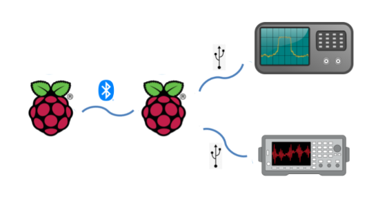

# Sandeep Nathuram Kundalwal

## Education
- M.Tech | Indian Institute Of Technology, Mandi | CGPA: 7.60
- B.Tech | RTU, Rajasthan | CGPA: 7.97

## Projects:
### INVESTING USER BEHAVIOUR TOWARDS PHISHING MAIL USING GAZE MOVEMENT (Ongoing)
- A research to investigate how Phishing Mail exploits various congnitive biases using Tobii EyeX Controller via a Web-Based Phishing Game.
### [BlueControl](https://github.com/SandeepKundalwal/BlueControl)
- Developed an Instrument Automation Software that remotely controls various instruments using Bluetooth via Standard Command For Programmable Instruments (SCPI). A Central Hub (Raspberry Pi) is connected to various instruments (Function Generator, Oscilliscope). These instruments can be controlled from another Host (Raspberry Pi) by sending SCPI Commands over Bluetooth
- Tools & Technologies Used: Python - RaspberryPi - Bluetooth  
  
### [Automated Plagiarism Detector](https://github.com/SandeepKundalwal/Automated-Plagiarism-Detector)
- Developed an Automated Plagiarism Detector as part of Teaching Assistant Work for CS309.
- Tools & Technologies Used: Java - Python - IntelliJ IDE - Visual Studio Code - JSoup  
### [360 Video Player With Eye Data Extraction](https://github.com/SandeepKundalwal/360-VideoPlayer-With-Eye-Data-Extraction)
- Developed a 360 Video Player for Virtual Reality HeadSets.
- Integrated **SRanipal** to the 360 Video Player for extracting eyes related information.
- Tools & Technologies Used: C# - Unity 3D - SRanipal SDK